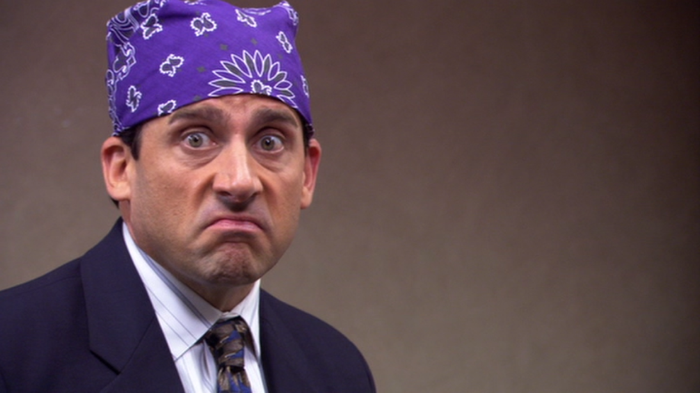

# reddit-bots
## Overview
Reddit bots which emulate TV characters & reply to comments with quotes from the character.

---

## Current Live Bots
### The Office
* [Dwight Schrute](http://reddit.com/u/dwight-schrute-bot)
* [Michael Scott](https://www.reddit.com/user/michaelgscottbot)

---

## How it works
 >Reddit comments are compared to lines that the character has responded to. If the line and comment are similar, the bot will get the character's response and reply to the comment.

## Example 
In Season 3 Episode 9, Dwight and Michael have an exchange:

>Dwight: "Prison Mike, what's the very very worst thing about prison?"

>Michael : "The worst thing about prison was the... was the Dementors. They... were flying all over the place, and they were scary. And they'd come down, and they'd suck the soul out of your body, and it hurt!."

> If Reddit comment is "What's the worst thing about prison" the match will be detected and the Michael Scott Bot will automatically reply with the line above.

---

## How replies are decided
The comments are compared to lines using fuzzy string matching. 

If the match is close enough, the bot will reply. 

https://github.com/seatgeek/fuzzywuzzy

---
